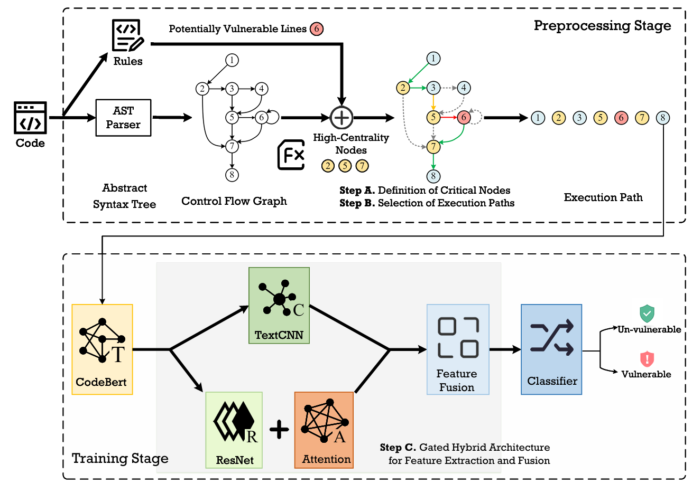

# SCPVD

**SCPVD: Scalable and Efficient Vulnerability Detection Approach through Critical Node-Guided Execution Path Construction**

This repository contains the source code and data processing scripts for the paper **"SCPVD: Scalable and Efficient Vulnerability Detection Approach through Critical Node-Guided Execution Path Construction"**.

SCPVD is a C/C++ vulnerability detection approach. It first identifies vulnerability-related statements with rule-based patterns, builds a control-flow graph (CFG), selects critical nodes with graph centrality analysis, constructs critical execution paths, and then feeds path-level representations into a CodeBERT-based neural classifier.

## Approach



The main workflow is:

1. Normalize source code and remove comments/docstrings.
2. Identify potentially vulnerability-related lines, such as memory operations, pointer operations, buffer operations, format-string APIs, integer operations, and command execution APIs.
3. Build an AST/CFG for C/C++ functions.
4. Select critical CFG nodes using vulnerability-related lines and centrality measures.
5. Generate critical execution paths guided by those nodes.
6. Encode path tokens with a pretrained Transformer encoder and classify the function as vulnerable or non-vulnerable.

## Repository Structure

```text
SCPVD/
|-- README.md
|-- framework.png
|-- code/
|   |-- run.py
|   |-- model.py
|   |-- c_cfg.py
|   |-- critical_path_analysis.py
|   `-- vulnerability_rules.py
|-- dataset/
|   `-- data/
|       |-- reveal.json
|       |-- devign.json
|       `-- MSR_data_cleaned.csv
`-- script_dataset/
    |-- convert_bigvul_csv_to_json.py
    |-- data_process_bigvul.py
    |-- data_process_devign.py
    `-- data_process_reveal.py
```

### Root Files

- `README.md`: Project description, dataset preparation, training/testing commands, and file explanations.
- `framework.png`: Overall framework figure used in the paper and documentation.

### `code/`

Core implementation of SCPVD.

- `run.py`: Main entry point for training, validation, and testing. It loads JSONL datasets, extracts critical path features, initializes the pretrained encoder, trains the model, saves checkpoints, and writes prediction results.
- `model.py`: Neural model definition. It wraps the pretrained encoder and applies a CNN/ResNet/attention-based path classifier for binary vulnerability detection.
- `c_cfg.py`: CFG construction and critical path extraction logic. It converts parsed C/C++ AST nodes into graph structures, caches path results, and records dataset-level statistics for CFG nodes and critical nodes.
- `critical_path_analysis.py`: Critical node and critical path analysis. It uses graph centrality metrics such as degree centrality, closeness centrality, and betweenness centrality, then greedily constructs paths covering important nodes.
- `vulnerability_rules.py`: Rule-based detector for vulnerability-related lines. It includes regular-expression patterns for memory APIs, pointer usage, buffer APIs, format-string functions, integer operations, and command execution APIs.

Runtime-generated files may appear under `code/cache/`; these are path extraction caches and can be removed when rebuilding features from scratch.

### `dataset/data/`

Dataset input directory. The files currently tracked in the repository are placeholders; download the full datasets separately and place/convert them into this directory.

- `reveal.json`: Intermediate ReVeal-format JSON file. It is produced by combining the original vulnerable and non-vulnerable ReVeal samples.
- `devign.json`: Devign-format JSON file converted from the original `function.json`.
- `MSR_data_cleaned.csv`: BigVul/MSR CSV file before conversion.

After processing, the scripts create split directories such as:

```text
dataset/data/reveal/
|-- train_reveal.jsonl
|-- valid_reveal.jsonl
`-- test_reveal.jsonl

dataset/data/devign/
|-- train_devign.jsonl
|-- valid_devign.jsonl
`-- test_devign.jsonl

dataset/data/bigvul/
|-- train_bigvul.jsonl
|-- valid_bigvul.jsonl
`-- test_bigvul.jsonl
```

Each JSONL item uses the following fields:

```json
{"idx": 0, "func": "int foo(...) { ... }", "target": 1}
```

- `idx`: Unique sample id.
- `func`: C/C++ function source code.
- `target`: Binary label, where `1` means vulnerable and `0` means non-vulnerable.

### `script_dataset/`

Dataset conversion and split scripts.

- `data_process_reveal.py`: Splits `dataset/data/reveal.json` into train/validation/test JSONL files while preserving positive/negative sample ratios.
- `data_process_devign.py`: Splits `dataset/data/devign.json` into train/validation/test JSONL files.
- `convert_bigvul_csv_to_json.py`: Converts BigVul/MSR CSV data into `dataset/data/MSR_data_cleaned.json`, keeping the vulnerability label and function body fields.
- `data_process_bigvul.py`: Splits the converted BigVul JSON/JSONL file into train/validation/test JSONL files.

## Environment

The code is Python-based and depends on PyTorch, Hugging Face Transformers, NetworkX, NumPy, scikit-learn, tqdm, pandas, and a C/C++ parsing utility named `parserTool`.

Typical dependencies:

```bash
pip install torch transformers networkx numpy scikit-learn tqdm pandas
```

Additional requirements:

- A local pretrained CodeBERT/Roberta-compatible model directory, for example `../models/codebert`.
- The `parserTool` package used by `run.py` for AST parsing and comment removal.
- A CUDA GPU is recommended. The current training script is written around GPU execution and single-GPU selection via `--gpu_id`.

## Dataset Preparation

### ReVeal

Original data:

<https://drive.google.com/drive/folders/1KuIYgFcvWUXheDhT--cBALsfy1I4utOy>

Expected conversion flow:

```text
vulnerables.json + non-vulnerables.json
-> dataset/data/reveal.json
-> dataset/data/reveal/train_reveal.jsonl
-> dataset/data/reveal/valid_reveal.jsonl
-> dataset/data/reveal/test_reveal.jsonl
```

Run:

```bash
cd script_dataset
python data_process_reveal.py
```

### Devign

Original data:

<https://drive.google.com/file/d/1x6hoF7G-tSYxg8AFybggypLZgMGDNHfF/edit>

Expected conversion flow:

```text
function.json
-> dataset/data/devign.json
-> dataset/data/devign/train_devign.jsonl
-> dataset/data/devign/valid_devign.jsonl
-> dataset/data/devign/test_devign.jsonl
```

Run:

```bash
cd script_dataset
python data_process_devign.py
```

### BigVul

Original data:

<https://github.com/ZeoVan/MSR_20_Code_vulnerability_CSV_Dataset/blob/master/all_c_cpp_release2.0.csv>

Expected conversion flow:

```text
MSR_data_cleaned.csv
-> dataset/data/MSR_data_cleaned.json
-> dataset/data/bigvul/train_bigvul.jsonl
-> dataset/data/bigvul/valid_bigvul.jsonl
-> dataset/data/bigvul/test_bigvul.jsonl
```

Run:

```bash
cd script_dataset
python convert_bigvul_csv_to_json.py
python data_process_bigvul.py
```

## Training

The following example trains SCPVD on ReVeal. Run it from the `code/` directory:

```bash
cd code
python run.py \
  --output_dir=./saved_models \
  --model_type=roberta \
  --tokenizer_name=../models/codebert \
  --model_name_or_path=../models/codebert \
  --do_train \
  --train_data_file=../dataset/data/reveal/train_reveal.jsonl \
  --eval_data_file=../dataset/data/reveal/valid_reveal.jsonl \
  --test_data_file=../dataset/data/reveal/test_reveal.jsonl \
  --epoch 8 \
  --block_size 400 \
  --train_batch_size 5 \
  --eval_batch_size 8 \
  --learning_rate 2e-5 \
  --max_grad_norm 1.0 \
  --evaluate_during_training \
  --seed 123456 \
  --d_size 128 \
  --gradient_accumulation_steps 8 \
  --gpu_id 1 \
  --enable_best_model
```

Important arguments:

- `--output_dir`: Directory for saved checkpoints.
- `--model_type`: Transformer backbone type. The default experiment uses `roberta`.
- `--model_name_or_path`: Path to the pretrained model weights.
- `--tokenizer_name`: Path/name of the tokenizer.
- `--block_size`: Maximum token length for each code/path sequence.
- `--filter_size`: Number of critical paths used by the model. Default: `3`.
- `--cnn_size`: CNN hidden size. Default: `128`.
- `--d_size`: Path fusion hidden size. Default: `128`.
- `--enable_best_model`: Save `checkpoint-best/model.bin` based on validation performance in addition to the final checkpoint.
- `--checkpoint_type`: Select `best` or `final` when evaluating/testing.
- `--gpu_id`: GPU index used for training/testing.

## Testing

Run testing from the `code/` directory:

```bash
cd code
python run.py \
  --output_dir=./saved_models \
  --model_type=roberta \
  --tokenizer_name=../models/codebert \
  --model_name_or_path=../models/codebert \
  --do_test \
  --train_data_file=../dataset/data/reveal/train_reveal.jsonl \
  --eval_data_file=../dataset/data/reveal/valid_reveal.jsonl \
  --test_data_file=../dataset/data/reveal/test_reveal.jsonl \
  --eval_batch_size 8 \
  --gpu_id 1 \
  --checkpoint_type=best
```

The script writes predictions to:

```text
code/saved_models/predictions.txt
```

Each line has the format:

```text
idx<TAB>prediction
```

where `prediction` is `1` for vulnerable and `0` for non-vulnerable.

If you use an external evaluator, pass the ground-truth JSONL file and prediction file to it, for example:

```bash
python ../evaluator/evaluator.py \
  -a ../dataset/data/reveal/test_reveal.jsonl \
  -p saved_models/predictions.txt
```

Note: the `evaluator/` directory is not included in this repository snapshot.

## Outputs and Caches

Training creates:

```text
code/saved_models/
|-- checkpoint-final/
|   |-- model.bin
|   |-- config.json
|   `-- tokenizer files
`-- checkpoint-best/
    `-- model.bin
```

Feature extraction may create:

```text
code/cache/paths/
```

These cache files store extracted CFG path information by sample id. Delete `code/cache/` if you change CFG/path extraction logic and want to regenerate features.

## Notes

- The repository does not include full datasets or pretrained model weights.
- The scripts assume the dataset JSONL files contain `idx`, `func`, and `target`.
- The current implementation focuses on C/C++ function-level vulnerability detection.
- For reproducibility, keep the same random seed, dataset split, pretrained model, and hyperparameters used in the paper.
